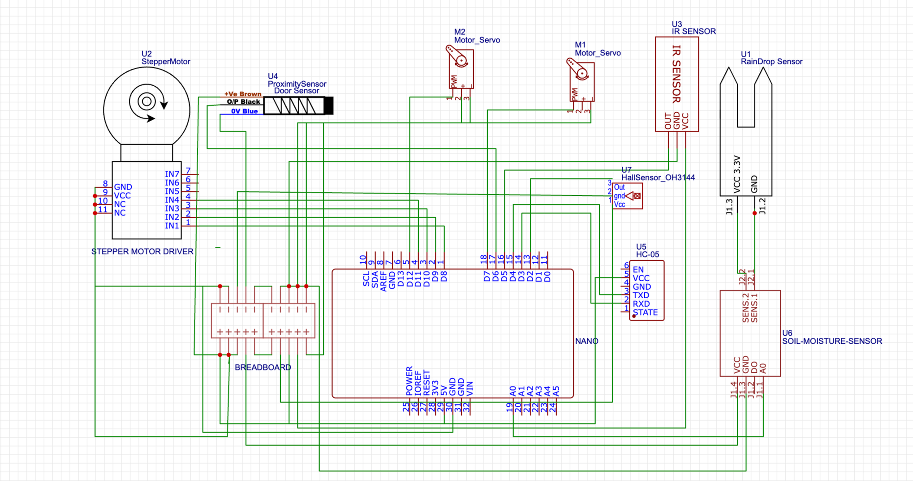

♻️ iot102-smart-recycle-bin: Thùng Rác Thông Minh Phân Loại Rác Tự Động

Chào mừng bạn đến với dự án **Thùng Rác Thông Minh Phân Loại Rác Tự Động** của nhóm chúng tôi! Đây là thành quả của môn học IOT102 - SE19B02 tại Đại học FPT. Chúng tôi rất hào hứng được chia sẻ giải pháp nhỏ nhưng ý nghĩa này nhằm góp phần bảo vệ môi trường và thúc đẩy thói quen tái chế tại gia đình.

## ✨ Giới thiệu dự án

Bạn có bao giờ cảm thấy việc phân loại rác tại nhà thật rắc rối? Dự án của chúng tôi mang đến một giải pháp thông minh: một chiếc thùng rác có khả năng tự động phân loại rác thành 3 loại chính: **kim loại, rác ướt và rác khô**. Mục tiêu là đơn giản hóa quy trình tái chế, giúp mọi người dễ dàng hơn trong việc bảo vệ hành tinh xanh của chúng ta.

## 📸 Hình ảnh sản phẩm

*   **Sơ đồ mạch:**
    
    _Sơ đồ mạch nguyên lý của hệ thống._

## 🎬 Video Demo

Để có cái nhìn trực quan hơn về cách sản phẩm hoạt động, mời bạn xem video demo của chúng tôi qua link dưới đây:

**[➡️ Xem Video Demo trên Google Drive](https://drive.google.com/file/d/1ymjLAYi3exukpWBJ-ppfKQA7SNAMkmQ6/view?usp=sharing)**

## ⚙️ Nguyên lý hoạt động

Hệ thống của chúng tôi hoạt động dựa trên sự kết hợp của các cảm biến thông minh:

1.  **IR Sensor:** Phát hiện khi có vật thể được đặt lên khay.
2.  **Metal Sensor (NPN):** Kiểm tra xem vật thể có phải là kim loại không. Nếu có, stepper motor sẽ di chuyển để đưa nó vào thùng kim loại.
3.  **Rain Sensor:** Nếu không phải kim loại, hệ thống đọc độ ẩm. Nếu ướt, nó sẽ được đưa vào thùng ướt.
4.  **Dry Waste:** Nếu không phải kim loại và không ướt, nó sẽ đi vào thùng khô.

## 📦 Linh kiện chính

Các linh kiện tạo nên "trái tim" của thùng rác thông minh:

*   Arduino Uno Board
*   Metal Sensor (NPN)
*   Rain Sensor
*   Stepper Motor + Driver
*   Infrared Sensor (IR)
*   Servo Motor (SG90)
*   HC-05 Bluetooth Module

## 👥 Đội ngũ phát triển

Chúng tôi là Nhóm 3, những người đã cùng nhau xây dựng dự án này:

*   **Lê Văn Đạt – Leader**
*   Thái Sơn - Member
*   Phan Trọng Hùng - Member
*   Võ Phạm Mỹ - Member
*   Nguyễn Châu Anh Khoa - Member

Cảm ơn bạn đã quan tâm đến dự án của chúng tôi!
